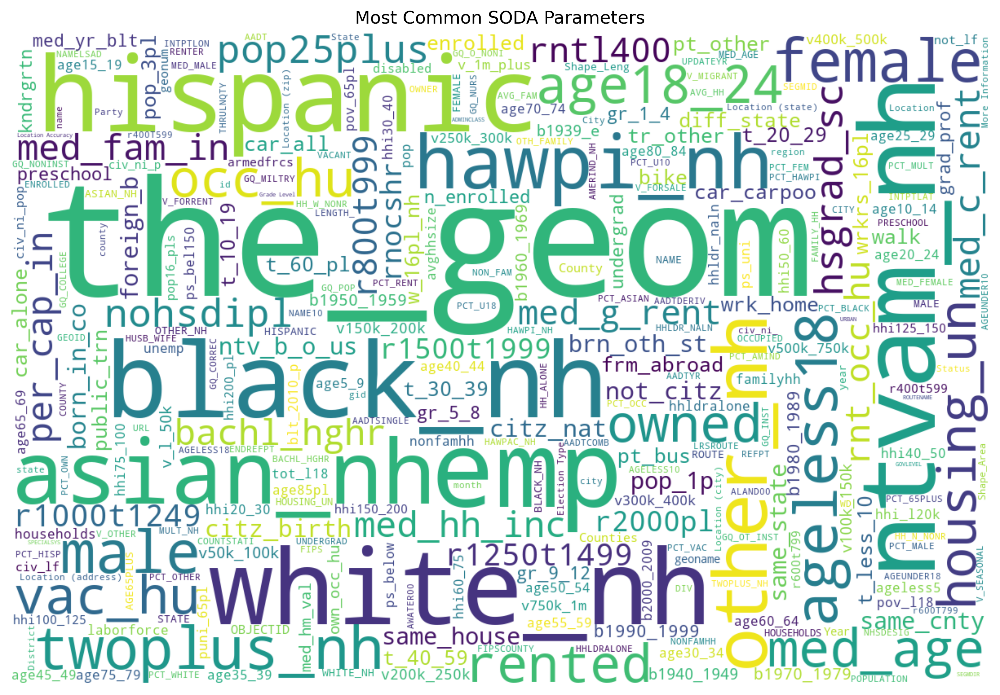
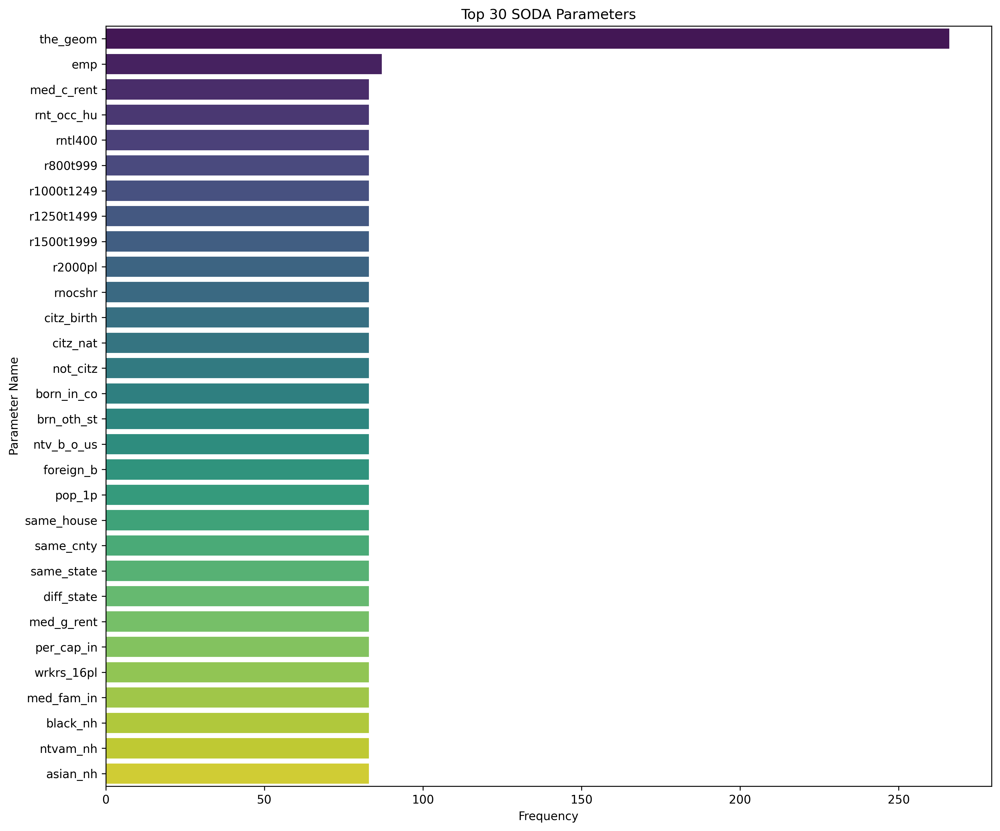
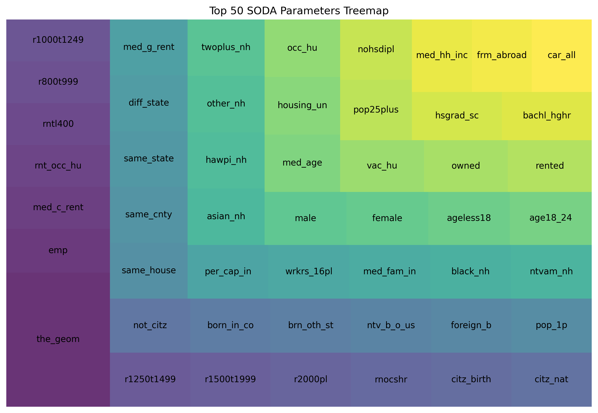
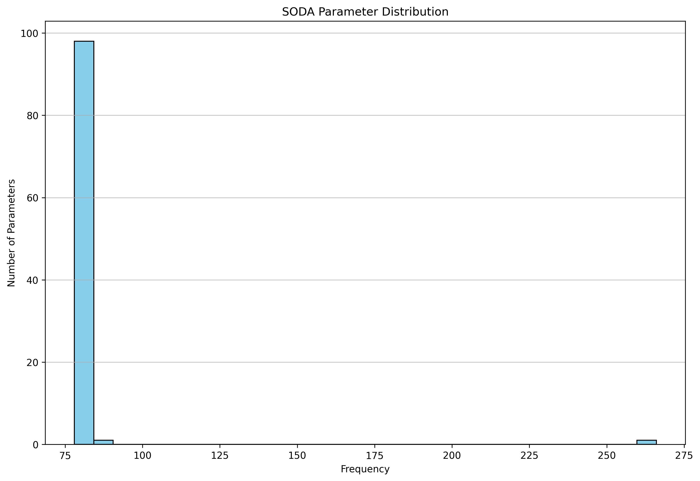
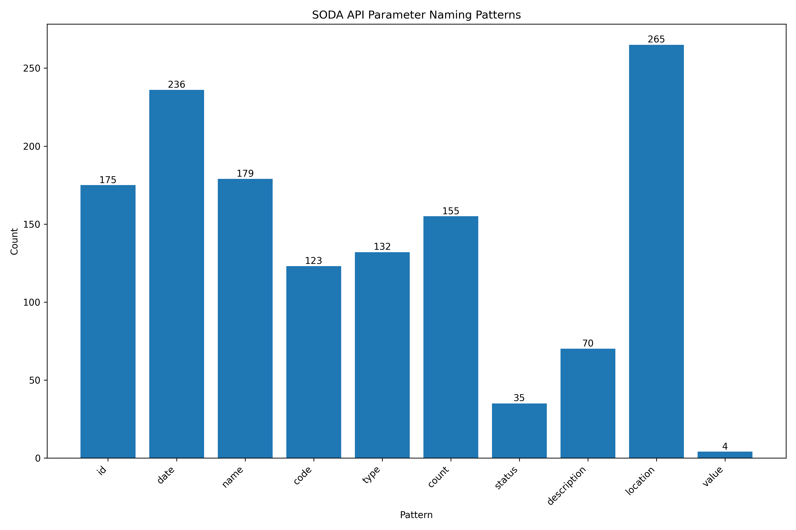
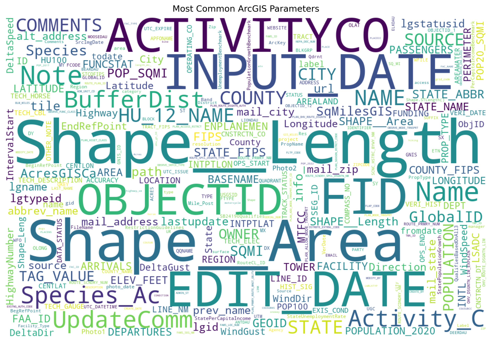
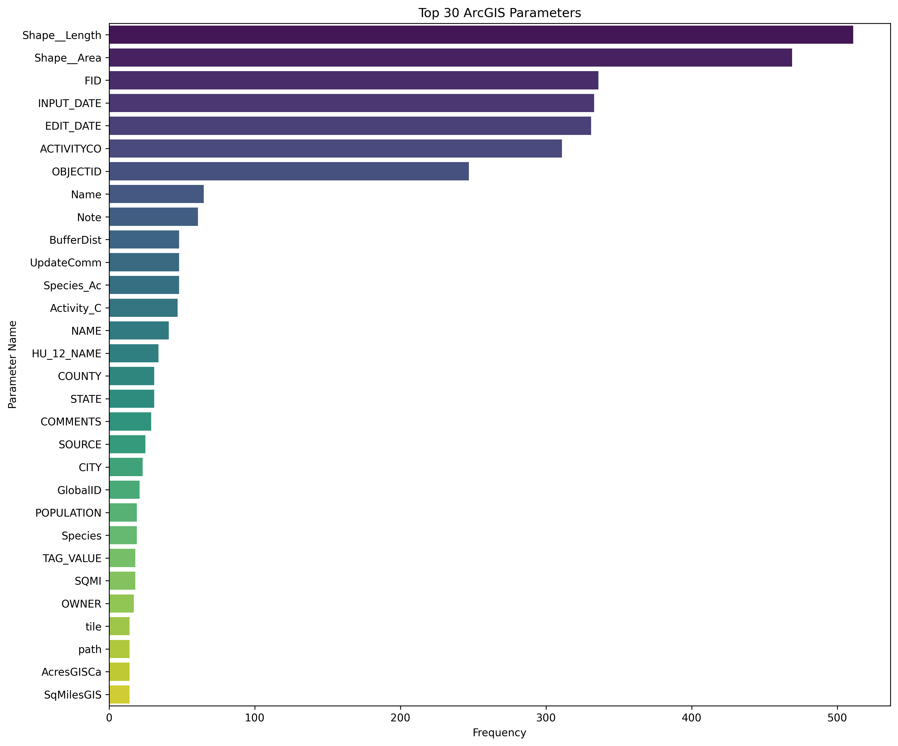
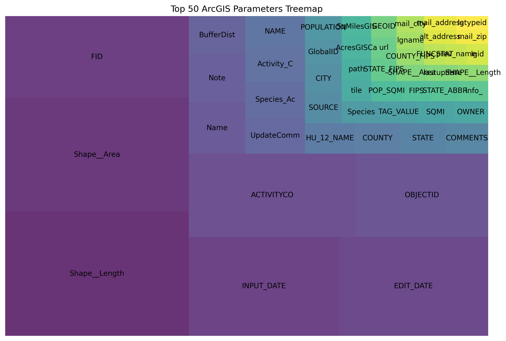
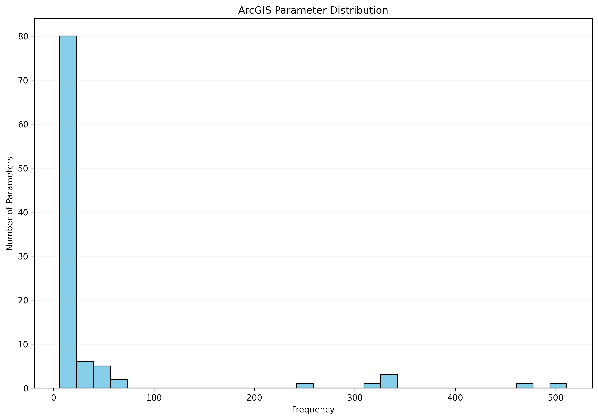
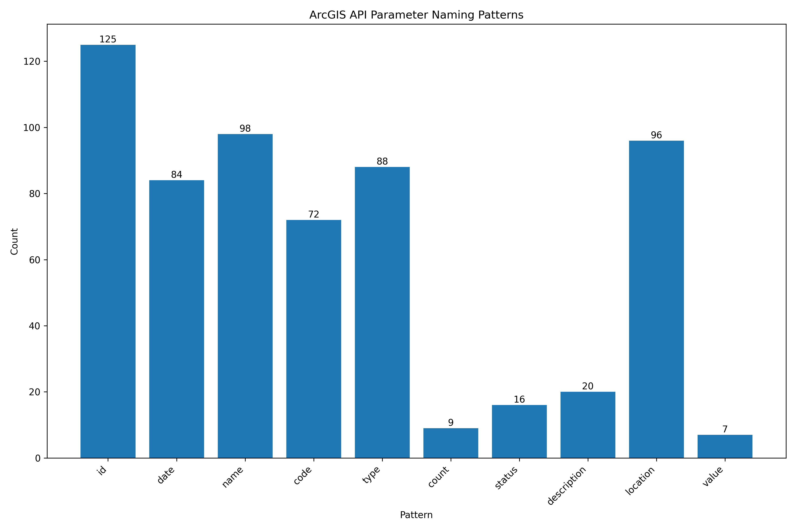

# API Parameter Analysis Tool

This tool analyzes parameters from SODA and ArcGIS APIs, extracting metadata and generating visualizations to help understand parameter usage patterns to create a URL template for these providers

## Overview

The API Parameter Analysis Tool consists of several scripts that work together to:

1. Collect data from SODA and ArcGIS APIs
2. Extract metadata and parameters from the collected data
3. Analyze the parameters and generate visualizations

## Prerequisites

- Python 3.6+
- Required Python packages (install using `pip install -r requirements.txt`):
  - requests
  - pandas
  - matplotlib
  - seaborn
  - wordcloud
  - numpy
  - json
  - logging
  - os
  - collections

## Folder Structure

```
.
├── Soda/                      # Raw SODA API data
├── ArcGis/                    # Raw ArcGIS API data
├── MetaDataSoda/              # Extracted SODA metadata
├── MetaDataArcGis/            # Extracted ArcGIS metadata
├── output/                    # Analysis output
│   ├── soda/                  # SODA analysis results
│   └── arcgis/                # ArcGIS analysis results
├── soda.py                    # Script to collect SODA API data
├── arcgis.py                  # Script to collect ArcGIS API data
├── extract_api_parameters.py  # Script to extract metadata
├── analyze_apis.py            # Script to analyze and visualize
├── run_workflow.sh            # Shell script to run the complete workflow
└── README.md                  # This file
```

## Scripts

### 1. Data Collection

#### `soda.py`
- Fetches metadata from SODA APIs
- Saves the raw data to the `Soda/` directory

#### `arcgis.py`
- Fetches metadata from ArcGIS APIs
- Saves the raw data to the `ArcGis/` directory

### 2. Metadata Extraction

#### `extract_api_parameters.py`
- Processes the raw API data from `Soda/` and `ArcGis/` directories
- Extracts metadata and parameters
- Saves the extracted metadata to `MetaDataSoda/` and `MetaDataArcGis/` directories
- Logs detailed information about the extraction process

### 3. Analysis and Visualization

#### `analyze_apis.py`
- Analyzes the extracted metadata from `MetaDataSoda/` and `MetaDataArcGis/` directories
- Generates visualizations including:
  - Word clouds of parameter names
  - Bar charts of parameter frequencies
  - Summary reports
- Saves all visualizations and reports to the `output/` directory

## Example Visualizations

### SODA API Visualizations

#### Word Cloud


#### Top Parameters Bar Chart


#### Parameter Treemap


#### Parameter Distribution


#### Parameter Patterns


### ArcGIS API Visualizations

#### Word Cloud


#### Top Parameters Bar Chart


#### Parameter Treemap


#### Parameter Distribution


#### Parameter Patterns


## Running the Tool

### Option 1: Run the Complete Workflow

To run the complete workflow (data collection, metadata extraction, and analysis), simply execute:

```bash
./run_workflow.sh
```

### Option 2: Run Individual Scripts

You can also run each script individually:

1. Collect data:
   ```bash
   python soda.py
   python arcgis.py
   ```

2. Extract metadata:
   ```bash
   python extract_api_parameters.py
   ```

3. Analyze and visualize:
   ```bash
   python analyze_apis.py
   ```

## Output

After running the complete workflow, you'll find:

1. Raw API data in `Soda/` and `ArcGis/` directories
2. Extracted metadata in `MetaDataSoda/` and `MetaDataArcGis/` directories
3. Analysis results in `output/` directory:
   - Word clouds in `output/soda/wordcloud.png` and `output/arcgis/wordcloud.png`
   - Bar charts in `output/soda/barchart.png` and `output/arcgis/barchart.png`
   - Summary reports in `output/soda/report.txt` and `output/arcgis/report.txt`
   - Detailed logs in `output/api_analysis.log`

## Customization

You can customize the analysis by modifying the following:

- To change the number of top parameters shown in visualizations, modify the `TOP_N` constant in `analyze_apis.py`
- To adjust the appearance of visualizations, modify the visualization parameters in `analyze_apis.py`

## Troubleshooting

If you encounter any issues:

1. Check the log file at `output/api_analysis.log` for detailed error messages
2. Ensure all required directories exist
3. Verify that you have the necessary permissions to read/write to the directories
4. Make sure all required Python packages are installed 