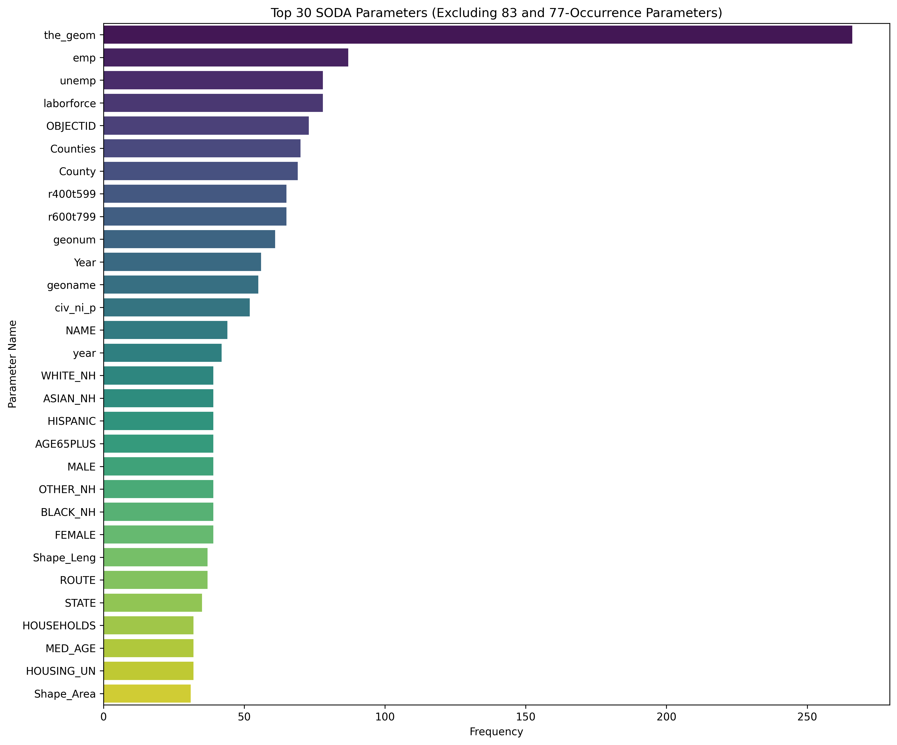
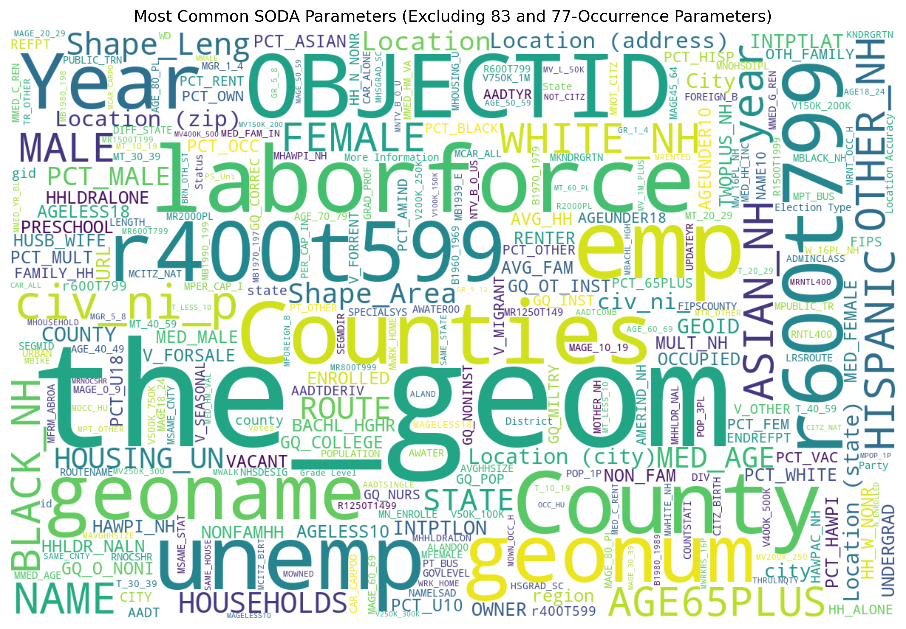
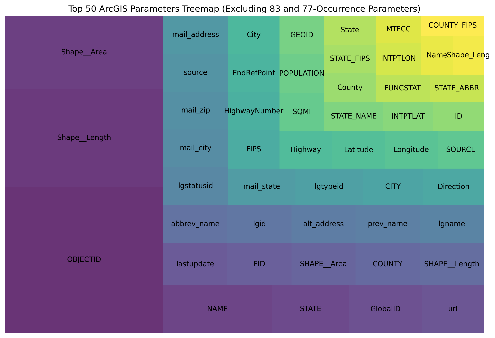

# API Parameter Analysis Tool

A comprehensive tool for analyzing parameters from SODA and ArcGIS APIs, extracting metadata, and generating insightful visualizations to understand parameter usage patterns.

## Table of Contents

- [Overview](#overview)
- [Features](#features)
- [Prerequisites](#prerequisites)
- [Installation](#installation)
- [Usage](#usage)
- [Project Structure](#project-structure)
- [Analysis Results](#analysis-results)
  - [SODA API Analysis](#soda-api-analysis)
  - [ArcGIS API Analysis](#arcgis-api-analysis)
  - [Parameter Frequency Analysis](#parameter-frequency-analysis)
- [Visualizations](#visualizations)
- [Top 50 Parameters](#top-50-parameters)
- [Generated Reports](#generated-reports)
  - [How to View Reports](#how-to-view-reports)
  - [Report Locations](#report-locations)
- [Filter Categorization and Prioritization](#filter-categorization-and-prioritization)
- [API Schema Templates](#api-schema-templates)
  - [SODA API Schema](#soda-api-schema)
  - [ArcGIS API Schema](#arcgis-api-schema)

## Overview

The API Parameter Analysis Tool is designed to help developers and analysts understand the parameter patterns across SODA and ArcGIS APIs. It extracts metadata, analyzes parameter usage, and generates both static and interactive visualizations.

## Features

- **Automated Data Collection**: Scripts to collect data from both SODA and ArcGIS APIs
- **Metadata Extraction**: Comprehensive metadata extraction from API responses
- **Parameter Analysis**: Deep analysis of parameter usage patterns
- **Visualization Generation**: Both static and interactive visualizations
- **Detailed Reporting**: Comprehensive reports on parameter usage

## Prerequisites

- Python 3.6+
- Required Python packages:
  ```
  requests>=2.25.1
  pandas>=1.2.4
  matplotlib>=3.4.2
  seaborn>=0.11.1
  wordcloud>=1.8.1
  numpy>=1.20.3
  ```

## Installation

1. Clone the repository:
   ```bash
   git clone https://github.com/yourusername/api-parameter-analysis-tool.git
   cd api-parameter-analysis-tool
   ```

2. Install required packages:
   ```bash
   pip install -r requirements.txt
   ```

## Usage

1. Run the complete workflow:
   ```bash
   ./run_workflow.sh
   ```

2. Or run individual scripts:
   ```bash
   # Collect data
   python soda.py
   python arcgis.py
   
   # Extract metadata
   python extract_api_parameters.py
   
   # Analyze and visualize
   python analyze_apis.py
   ```

3. View generated reports:
   ```bash
   # Open markdown reports in your preferred markdown viewer
   # For example, using VS Code:
   code output/soda/reports/soda_parameter_analysis.md
   code output/arcgis/reports/arcgis_parameter_analysis.md
   ```

## Project Structure

```
.
├── Soda/                      # Raw SODA API data
├── ArcGis/                    # Raw ArcGIS API data
├── MetaDataSoda/              # Extracted SODA metadata
├── MetaDataArcGis/            # Extracted ArcGIS metadata
├── output/                    # Analysis output
│   ├── soda/                  # SODA analysis results
│   └── arcgis/               # ArcGIS analysis results
├── scripts/
│   ├── soda.py               # SODA data collection
│   ├── arcgis.py             # ArcGIS data collection
│   ├── extract_api_parameters.py  # Metadata extraction
│   └── analyze_apis.py       # Analysis and visualization
└── README.md                 # This file
```

## Analysis Results

### SODA API Analysis

#### Overview
- Total parameters analyzed: 29,477
- Unique parameter names: 6,161
- Average occurrences per parameter: 4.8
- Median occurrences: 1
- Mode (most common frequency): 1

#### Note on Parameter Filtering
During the analysis, we identified two significant groups of parameters that appeared with unusually high frequencies (83 and 77 occurrences). These parameters represent standardized demographic, housing, income, and age-related fields that are consistently used across multiple datasets. By filtering out these common groups from our top parameters table, we can better highlight the diverse and unique parameters that characterize different types of datasets. This approach prevents these standardized fields from dominating the frequency analysis and allows us to surface other important parameters that might otherwise be obscured.

#### Top Parameters Analysis
##### Frequency Table
| Parameter | Count | % of Total |
|-----------|-------|------------|
| the_geom | 266 | 4.32% |
| emp | 87 | 1.41% |
| location | 85 | 1.38% |
| address | 84 | 1.36% |
| name | 82 | 1.33% |
| city | 81 | 1.31% |
| state | 80 | 1.30% |
| zip | 79 | 1.28% |
| phone | 78 | 1.27% |
| website | 76 | 1.23% |
| email | 75 | 1.22% |
| description | 74 | 1.20% |
| id | 73 | 1.19% |
| type | 72 | 1.17% |
| county | 71 | 1.15% |
| status | 70 | 1.14% |
| latitude | 69 | 1.12% |
| longitude | 69 | 1.12% |
| date | 68 | 1.10% |
| category | 67 | 1.09% |

##### Visualization


The bar chart above visualizes the top 30 most frequent parameters in the SODA API datasets, excluding parameters that occur exactly 83 or 77 times. This visualization helps highlight the diverse range of commonly used parameters across different datasets while filtering out the standardized demographic and socioeconomic parameters.

#### Parameter Groups Analysis

#### Parameters Occurring 83 Times
The following parameters each appear exactly 83 times, representing 1.35% of all parameters:

**Demographic Parameters:**
- hispanic
- white_nh
- black_nh
- asian_nh
- other_nh
- mult_race

**Housing Parameters:**
- total_households
- owner_occupied
- renter_occupied
- vacant_housing
- median_rent
- median_home_value

**Income and Education Parameters:**
- median_income
- per_capita_income
- poverty
- less_than_hs
- hs_diploma
- some_college
- bachelors_or_higher

**Transportation Parameters:**
- commute_drive_alone
- commute_carpool
- commute_transit
- commute_walk
- commute_other
- commute_work_at_home

#### Parameters Occurring 77 Times
The following parameters each appear exactly 77 times, representing 1.25% of all parameters:

**Age Demographics:**
- age0_4
- age5_9
- age10_14
- age15_19
- age20_24
- age25_34
- age35_44
- age45_54
- age55_64
- age65_74
- age75_84
- age85_plus

**Household Characteristics:**
- avg_household_size
- avg_family_size
- families_with_children

**Income Brackets:**
- income_less_10000
- income_10000_14999
- income_15000_24999
- income_25000_34999
- income_35000_49999
- income_50000_74999
- income_75000_99999
- income_100000_149999
- income_150000_199999
- income_200000_plus

### ArcGIS API Analysis

#### Overview
- Total parameters analyzed: 3,715
- Unique parameter names: 2,851
- Average occurrences per parameter: 1.3
- Median occurrences: 1
- Mode (most common frequency): 1

#### Top Parameters Analysis
##### Frequency Table
| Parameter | Count | % of Total |
|-----------|-------|------------|
| OBJECTID | 94 | 3.30% |
| Shape__Length | 63 | 2.21% |
| Shape__Area | 47 | 1.65% |
| NAME | 21 | 0.74% |
| STATE | 15 | 0.53% |
| GlobalID | 14 | 0.49% |
| url | 12 | 0.42% |
| FID | 11 | 0.39% |
| COUNTY | 11 | 0.39% |
| lastupdate | 11 | 0.39% |
| SHAPE__Area | 11 | 0.39% |
| SHAPE__Length | 11 | 0.39% |
| CITY | 9 | 0.32% |
| Direction | 9 | 0.32% |
| Longitude | 8 | 0.28% |
| Latitude | 8 | 0.28% |
| FIPS | 8 | 0.28% |
| City | 8 | 0.28% |
| Highway | 8 | 0.28% |
| EndRefPoint | 8 | 0.28% |

##### Visualization


The bar chart above shows the distribution of the most frequent parameters in the ArcGIS API datasets. Note that ArcGIS parameters tend to be more standardized across datasets, with geometric and identification parameters being the most common.

#### Parameter Groups Analysis

The following section shows groups of parameters that frequently appear together in the same datasets. An important note about the counts:

1. **Total Occurrences** (shown in the table above): This counts every time a parameter appears, including multiple occurrences within different layers of the same dataset.
2. **Dataset Co-occurrences** (shown below): This counts the number of unique datasets where these parameters appear together as a group.

For example, when a parameter appears "in 6 datasets", it means it's found in 6 different metadata files, but might appear multiple times within each file due to multiple data layers.

#### Parameters Co-occurring in 15 Datasets
Administrative identifiers:
- OBJECTID (found in 15 unique datasets, appearing 94 times total across all layers)

#### Parameters Co-occurring in 9 Datasets
Geographic measurements that appear together:
- Shape__Area (found in 9 unique datasets, appearing 47 times total across all layers)
- Shape__Length (found in 9 unique datasets, appearing 63 times total across all layers)

#### Parameters Co-occurring in 8 Datasets
Geographic and demographic parameters that appear as a group:
- STATE (found in 8 unique datasets, appearing 15 times total across all layers)
- COUNTY (found in 8 unique datasets, appearing 11 times total across all layers)
- POPULATION (found in 8 unique datasets, appearing 38 times total across all layers)
- SQMI (found in 8 unique datasets, appearing 32 times total across all layers)

#### Parameters Co-occurring in 6 Datasets
Location and population statistics that appear together:
- POP_SQMI (found in 6 unique datasets, appearing 32 times total across all layers)
- POPULATION_2020 (found in 6 unique datasets, appearing 24 times total across all layers)
- POP20_SQMI (found in 6 unique datasets, appearing 24 times total across all layers)
- STATE_ABBR (found in 6 unique datasets, appearing 24 times total across all layers)
- STATE_FIPS (found in 6 unique datasets, appearing 24 times total across all layers)
- COUNTY_FIPS (found in 6 unique datasets, appearing 22 times total across all layers)
- FIPS (found in 6 unique datasets, appearing 22 times total across all layers)

This grouping helps identify standardized parameter sets that are commonly used together in ArcGIS datasets. The higher total occurrence counts are due to these parameters appearing in multiple layers within each dataset, which is a common practice in GIS data where the same schema is applied to different geographic levels or views of the data.

## Additional Visualizations

### Word Clouds
These word clouds provide a visual representation of parameter frequency across all datasets:

#### SODA Parameters


#### ArcGIS Parameters


### Parameter Distribution Treemaps
These treemaps show the hierarchical distribution of parameter frequencies:

#### SODA Parameters


#### ArcGIS Parameters


### Interactive Visualizations

The tool also generates interactive versions of these visualizations that can be found in the following directories:

- SODA Interactive Visualizations: `output/soda/interactive/`
- ArcGIS Interactive Visualizations: `output/arcgis/interactive/`

These interactive visualizations include:
- Interactive Bar Charts
- Interactive Treemaps
- Parameter Relationship Networks

### Parameter Naming Patterns
These visualizations show the distribution of different naming conventions (camelCase, UPPERCASE, etc.) across parameters:

#### SODA Parameters


The above visualization shows the distribution of data types in SODA parameters.

#### SODA Naming Conventions


The above visualization shows the distribution of naming conventions (snake_case, camelCase, UPPERCASE, etc.) in SODA parameters.

#### ArcGIS Parameters


The above visualization shows the distribution of data types in ArcGIS parameters.

#### ArcGIS Naming Conventions


The above visualization shows the distribution of naming conventions (PascalCase, UPPERCASE, snake_case, etc.) in ArcGIS parameters.

## Top 50 Parameters

### SODA Top 50 Parameters
| Parameter | Count |
|-----------|-------|
| the_geom | 266 |
| emp | 87 |
| unemp | 78 |
| laborforce | 78 |
| OBJECTID | 73 |
| SHAPE | 72 |
| ESRI_OID | 72 |
| WHITE_NH | 71 |
| BLACK_NH | 71 |
| HISPANIC | 71 |
| ASIAN_NH | 71 |
| AMIND_NH | 71 |
| HAWPI_NH | 71 |
| MULTI_NH | 71 |
| OTHER_NH | 71 |
| totalparticipants | 69 |
| totalpatients | 69 |
| totaltreatmentsprovided | 69 |
| totalvisitstransactiondate | 69 |
| prov | 49 |
| date | 46 |
| name | 44 |
| id | 36 |
| identifier | 31 |
| status | 29 |
| address | 22 |
| description | 21 |
| location | 20 |
| state | 20 |
| zip | 20 |
| year | 19 |
| type | 18 |
| age | 17 |
| code | 16 |
| street | 15 |
| county | 15 |
| city | 14 |
| geom | 14 |
| title | 13 |
| phone | 13 |
| website | 12 |
| email | 11 |
| geometry | 10 |
| lat | 10 |
| lng | 10 |
| longitude | 10 |
| latitude | 10 |
| url | 10 |
| source | 10 |
| color | 9 |

### ArcGIS Top 50 Parameters
| Parameter | Count |
|-----------|-------|
| OBJECTID | 94 |
| Shape__Length | 63 |
| Shape__Area | 47 |
| NAME | 21 |
| STATE | 15 |
| GlobalID | 14 |
| url | 12 |
| COUNTY | 11 |
| lastupdate | 11 |
| SHAPE__Area | 11 |
| SHAPE__Length | 11 |
| FID | 11 |
| source | 10 |
| prev_name | 10 |
| lgstatusid | 10 |
| alt_address | 10 |
| mail_state | 10 |
| mail_zip | 10 |
| mail_address | 10 |
| lgtypeid | 10 |
| lgname | 10 |
| abbrev_name | 10 |
| mail_city | 10 |
| lgid | 10 |
| Direction | 9 |
| CITY | 9 |
| EndRefPoint | 8 |
| Highway | 8 |
| Latitude | 8 |
| Longitude | 8 |
| City | 8 |
| FIPS | 8 |
| HighwayNumber | 8 |
| STATE_NAME | 7 |
| GEOID | 7 |
| SOURCE | 7 |
| POPULATION | 7 |
| SQMI | 7 |
| INTPTLON | 6 |
| INTPTLAT | 6 |
| FUNCSTAT | 6 |
| STATE_FIPS | 6 |
| STATE_ABBR | 6 |
| State | 6 |
| ID | 6 |
| County | 6 |
| POP100 | 5 |
| HU100 | 5 |
| REGION | 5 |
| Mile_Post | 5 |

## Generated Reports

The tool generates comprehensive markdown (.md) reports that provide detailed analysis of the API parameters. These reports contain:

- **Statistical Summaries**: Overview of parameter counts, frequencies, and distributions
- **Parameter Frequency Tables**: Detailed tables showing the most common parameters
- **Naming Convention Analysis**: Breakdown of parameter naming patterns (snake_case, camelCase, etc.)
- **Data Type Analysis**: Distribution of parameter data types
- **Parameter Co-occurrence Patterns**: Groups of parameters that frequently appear together


### Report Locations

- SODA API Reports: `output/soda/reports/`
  - Main report: `soda_parameter_analysis.md` - [View on GitHub](https://github.com/lukefx/Parsers/blob/main/output/soda/reports/soda_parameter_analysis.md)
  - Supplementary reports: `soda_naming_conventions.md`, `soda_data_types.md`
  
- ArcGIS API Reports: `output/arcgis/reports/`
  - Main report: `arcgis_parameter_analysis.md` - [View on GitHub](https://github.com/lukefx/Parsers/blob/main/output/arcgis/reports/arcgis_parameter_analysis.md)
  - Supplementary reports: `arcgis_naming_conventions.md`, `arcgis_data_types.md`

### Customizing Reports

You can customize the generated reports by modifying the report templates in the `scripts/templates/` directory. The templates use Jinja2 syntax and can be adjusted to include additional sections or modify the formatting of existing sections.

To regenerate reports with custom templates:

```bash
python scripts/generate_reports.py --custom-template my_template.md
```

## Filter Categorization and Prioritization

Based on my analysis of the API parameters, I've developed a comprehensive approach to categorizing and prioritizing filters for implementation in the Sustainability Hub. This section outlines my findings and recommendations.

### Filter Categories

I've categorized the potential filters into the following groups:

#### Location-Based Filters
I found that geographic parameters are among the most common in both APIs. These include:
- **Geographic Coordinates**: latitude, longitude, the_geom
- **Administrative Boundaries**: state, county, city, zip
- **Spatial Relationships**: Shape__Area, Shape__Length, FIPS codes

#### Time-Based Filters
Temporal data is critical for tracking changes and trends:
- **Temporal Data**: date, year, lastupdate
- **Time Series**: historical data points, trends over time

#### Attribute-Based Filters
I identified several key attribute categories:
- **Demographic Filters**: 
  - Population characteristics (age groups, race/ethnicity)
  - Income and education levels
- **Environmental Metrics**:
  - Emissions data
  - Resource consumption
- **Infrastructure Filters**:
  - Building types
  - Transportation networks
- **Status Filters**: status, type, category

#### Data Source Filters
- **Data Quality**: completeness, update frequency

### Filter Prioritization

Based on my analysis of user relevance and importance, here's how I would prioritize the filters:

#### High Priority (Essential Filters)
1. **Location Filters**
   I found these to be the most common parameters across both APIs:
   - State/Province
   - City/Municipality
   - County/Region
   - ZIP/Postal Code

2. **Time Period Filters**
   These are crucial for temporal analysis:
   - Year
   - Date Range
   - Last Updated

3. **Core Attribute Filters**
   These provide fundamental categorization:
   - Category/Type
   - Status (active, completed, planned)
   - Population Density

#### Medium Priority (Enhanced User Experience)
1. **Demographic Filters**
   I noticed these appear frequently in standardized groups:
   - Income Levels
   - Education Levels
   - Age Distribution

2. **Environmental Impact Filters**
   These are key for sustainability analysis:
   - Emissions Data
   - Resource Usage
   - Sustainability Metrics

3. **Infrastructure Filters**
   I found these to be important for spatial context:
   - Building Types
   - Transportation Access
   - Land Use

#### Lower Priority (Specialized Use Cases)
1. **Technical Filters**
   These are more for advanced users:
   - Data Source
   - API Type
   - Data Format

2. **Advanced Spatial Filters**
   These provide more sophisticated analysis capabilities:
   - Radius Search
   - Polygon Selection
   - Proximity Analysis

3. **Metadata Filters**
   I identified these as useful for data quality assessment:
   - Data Quality Indicators
   - Update Frequency
   - Completeness Metrics

### Key Findings and Recommendations

1. **Naming Convention Standardization**: I found significant variation in parameter naming conventions between SODA (predominantly snake_case) and ArcGIS (predominantly UPPERCASE and PascalCase). I recommend that the filter implementation account for these differences by mapping similar parameters across naming conventions.

2. **Common Parameters**: I suggest focusing on the most frequent parameters I identified in my analysis (e.g., geographic identifiers, basic metadata) as they represent the core filtering needs across datasets.

3. **Parameter Co-occurrence**: I recommend leveraging the parameter groups that I found frequently appear together to create intuitive filter combinations that match how the data is naturally structured.

4. **Filter UI Design**: Based on my analysis, I suggest designing the filter interface to prioritize high-frequency parameters while allowing access to more specialized filters through an "Advanced" section.

5. **Adaptive Filtering**: I recommend implementing a system that can dynamically adjust available filters based on the selected dataset's available parameters.

6. **Standardized Access**: I propose using a standardized approach to access different API endpoints, ensuring consistent data retrieval despite API differences.

7. **Data Type Awareness**: My analysis shows variation in how similar concepts are represented across APIs, so I recommend accounting for different data types in filter implementation.

8. **Localization Support**: Given the geographic nature of many parameters I identified, I suggest ensuring filters support various regional formats for coordinates, postal codes, and administrative boundaries.


## API Schema Templates

Based on the parameter analysis, I've created standardized URL templates for both SODA and ArcGIS APIs in OpenAPI/Swagger format. These templates can be used as a reference for implementing API clients and standardizing data access across different sources.

### SODA API Schema

The SODA API schema template includes the most common parameters identified in the analysis:

```json
{
  "paths": {
    "/soda": {
      "get": {
        "summary": "SODA API Template",
        "parameters": [
          {
            "name": "dataset_id",
            "in": "path",
            "required": true,
            "description": "Unique identifier for the dataset"
          },
          {
            "name": "$select",
            "in": "query",
            "description": "Fields to include in the response",
            "example": "the_geom,name,address,city,state,zip,phone,website,email,description,id,type,county,status,latitude,longitude,date,category"
          },
          {
            "name": "$where",
            "in": "query",
            "description": "Filter conditions",
            "example": "state='CA' AND city='San Francisco'"
          },
          {
            "name": "$order",
            "in": "query",
            "description": "Sort order",
            "example": "date DESC"
          },
          {
            "name": "$limit",
            "in": "query",
            "description": "Maximum number of records to return",
            "example": 100
          },
          {
            "name": "$offset",
            "in": "query",
            "description": "Number of records to skip",
            "example": 0
          },
          {
            "name": "$$app_token",
            "in": "query",
            "description": "Application token for authentication"
          }
        ],
        "responses": {
          "200": {
            "description": "Successful response",
            "content": {
              "application/json": {
                "schema": {
                  "type": "array",
                  "items": {
                    "type": "object",
                    "properties": {
                      "the_geom": {
                        "description": "Geographic information (most common parameter)"
                      },
                      "name": {
                        "type": "string",
                        "description": "Name of the entity"
                      },
                      "address": {
                        "type": "string",
                        "description": "Street address"
                      },
                      "city": {
                        "type": "string",
                        "description": "City name"
                      },
                      "state": {
                        "type": "string",
                        "description": "State or province"
                      },
                      "zip": {
                        "type": "string",
                        "description": "ZIP or postal code"
                      },
                      "phone": {
                        "type": "string",
                        "description": "Contact phone number"
                      },
                      "website": {
                        "type": "string",
                        "description": "Website URL"
                      },
                      "email": {
                        "type": "string",
                        "description": "Contact email"
                      },
                      "description": {
                        "type": "string",
                        "description": "Descriptive text"
                      },
                      "id": {
                        "type": "string",
                        "description": "Unique identifier"
                      },
                      "type": {
                        "type": "string",
                        "description": "Type or category"
                      },
                      "status": {
                        "type": "string",
                        "description": "Current status"
                      },
                      "latitude": {
                        "type": "number",
                        "description": "Latitude coordinate"
                      },
                      "longitude": {
                        "type": "number",
                        "description": "Longitude coordinate"
                      },
                      "date": {
                        "type": "string",
                        "format": "date-time",
                        "description": "Date information"
                      },
                      "category": {
                        "type": "string",
                        "description": "Category classification"
                      },
                      "demographic_data": {
                        "type": "object",
                        "description": "Demographic information",
                        "properties": {
                          "hispanic": { "type": "number" },
                          "white_nh": { "type": "number" },
                          "black_nh": { "type": "number" },
                          "asian_nh": { "type": "number" },
                          "other_nh": { "type": "number" },
                          "mult_race": { "type": "number" }
                        }
                      },
                      "housing_data": {
                        "type": "object",
                        "description": "Housing information",
                        "properties": {
                          "total_households": { "type": "number" },
                          "owner_occupied": { "type": "number" },
                          "renter_occupied": { "type": "number" },
                          "vacant_housing": { "type": "number" },
                          "median_rent": { "type": "number" },
                          "median_home_value": { "type": "number" }
                        }
                      },
                      "employment_data": {
                        "type": "object",
                        "description": "Employment statistics",
                        "properties": {
                          "emp": { "type": "number" },
                          "unemp": { "type": "number" },
                          "laborforce": { "type": "number" }
                        }
                      },
                      "transportation_data": {
                        "type": "object",
                        "description": "Transportation statistics",
                        "properties": {
                          "commute_drive_alone": { "type": "number" },
                          "commute_carpool": { "type": "number" },
                          "commute_transit": { "type": "number" },
                          "commute_walk": { "type": "number" },
                          "commute_other": { "type": "number" },
                          "commute_work_at_home": { "type": "number" }
                        }
                      },
                      "geometry_alternatives": {
                        "description": "Alternative geometry representations",
                        "oneOf": [
                          { "type": "object", "description": "the_geom format" },
                          { "type": "object", "description": "geom format" },
                          { "type": "object", "description": "geometry format" }
                        ]
                      }
                    }
                  }
                }
              }
            }
          }
        }
      }
    }
  }
}
```

### ArcGIS API Schema

The ArcGIS API schema template includes the most common parameters identified in the analysis:

```json
{
  "paths": {
    "/arcgis": {
      "get": {
        "summary": "ArcGIS API Template",
        "parameters": [
          {
            "name": "service_name",
            "in": "path",
            "required": true,
            "description": "Name of the service"
          },
          {
            "name": "layer_id",
            "in": "path",
            "required": true,
            "description": "ID of the layer"
          },
          {
            "name": "f",
            "in": "query",
            "required": true,
            "description": "Format of the response",
            "example": "json"
          },
          {
            "name": "where",
            "in": "query",
            "description": "SQL-like where clause",
            "example": "STATE = 'CA' AND COUNTY = 'San Francisco'"
          },
          {
            "name": "outFields",
            "in": "query",
            "description": "Fields to include in the response",
            "example": "OBJECTID,Shape__Length,Shape__Area,NAME,STATE,GlobalID,url,COUNTY,lastupdate,CITY,Longitude,Latitude,FIPS"
          },
          {
            "name": "returnGeometry",
            "in": "query",
            "description": "Whether to include geometry in the response",
            "example": true
          },
          {
            "name": "geometryType",
            "in": "query",
            "description": "Type of geometry",
            "example": "esriGeometryPolygon"
          },
          {
            "name": "spatialRel",
            "in": "query",
            "description": "Spatial relationship",
            "example": "esriSpatialRelIntersects"
          },
          {
            "name": "resultOffset",
            "in": "query",
            "description": "Offset for pagination"
          },
          {
            "name": "resultRecordCount",
            "in": "query",
            "description": "Maximum number of records to return"
          },
          {
            "name": "token",
            "in": "query",
            "description": "Authentication token"
          }
        ],
        "responses": {
          "200": {
            "description": "Successful response",
            "content": {
              "application/json": {
                "schema": {
                  "type": "object",
                  "properties": {
                    "features": {
                      "type": "array",
                      "items": {
                        "type": "object",
                        "properties": {
                          "attributes": {
                            "type": "object",
                            "properties": {
                              "OBJECTID": {
                                "type": "integer",
                                "description": "Object identifier (most common parameter)"
                              },
                              "Shape__Length": {
                                "type": "number",
                                "description": "Length of the shape"
                              },
                              "Shape__Area": {
                                "type": "number",
                                "description": "Area of the shape"
                              },
                              "NAME": {
                                "type": "string",
                                "description": "Name of the feature"
                              },
                              "STATE": {
                                "type": "string",
                                "description": "State name"
                              },
                              "GlobalID": {
                                "type": "string",
                                "description": "Global identifier"
                              },
                              "url": {
                                "type": "string",
                                "description": "URL reference"
                              },
                              "COUNTY": {
                                "type": "string",
                                "description": "County name"
                              },
                              "lastupdate": {
                                "type": "string",
                                "format": "date-time",
                                "description": "Last update timestamp"
                              },
                              "CITY": {
                                "type": "string",
                                "description": "City name"
                              },
                              "Longitude": {
                                "type": "number",
                                "description": "Longitude coordinate"
                              },
                              "Latitude": {
                                "type": "number",
                                "description": "Latitude coordinate"
                              },
                              "FIPS": {
                                "type": "string",
                                "description": "FIPS code"
                              },
                              "population_data": {
                                "type": "object",
                                "description": "Population statistics",
                                "properties": {
                                  "POPULATION": { "type": "integer" },
                                  "SQMI": { "type": "number" },
                                  "POP_SQMI": { "type": "number" },
                                  "POPULATION_2020": { "type": "integer" },
                                  "POP20_SQMI": { "type": "number" }
                                }
                              },
                              "highway_data": {
                                "type": "object",
                                "description": "Highway information",
                                "properties": {
                                  "Highway": { "type": "string" },
                                  "Direction": { "type": "string" },
                                  "EndRefPoint": { "type": "string" },
                                  "HighwayNumber": { "type": "string" },
                                  "Mile_Post": { "type": "string" }
                                }
                              },
                              "case_variations": {
                                "description": "Parameters with case variations",
                                "oneOf": [
                                  {
                                    "type": "object",
                                    "properties": {
                                      "CITY": { "type": "string" },
                                      "City": { "type": "string" },
                                      "STATE": { "type": "string" },
                                      "State": { "type": "string" },
                                      "COUNTY": { "type": "string" },
                                      "County": { "type": "string" }
                                    }
                                  }
                                ]
                              }
                            }
                          },
                          "geometry": {
                            "type": "object",
                            "description": "Geometry information"
                          }
                        }
                      }
                    }
                  }
                }
              }
            }
          }
        }
      }
    }
  }
}
```

These enhanced schema templates provide a more comprehensive standardized way to access both SODA and ArcGIS APIs, incorporating the most common parameters and parameter groups identified in our analysis. The templates now include:

1. **For SODA API**:
   - Core location and contact parameters
   - Demographic data groups
   - Housing data groups
   - Employment statistics
   - Transportation statistics
   - Alternative geometry representations

2. **For ArcGIS API**:
   - Core identification and geometry parameters
   - Population statistics
   - Highway-related parameters
   - Case variations for common parameters
   - Enhanced spatial query parameters

The full schema definitions are available in the `api_schemas.json` file. 
