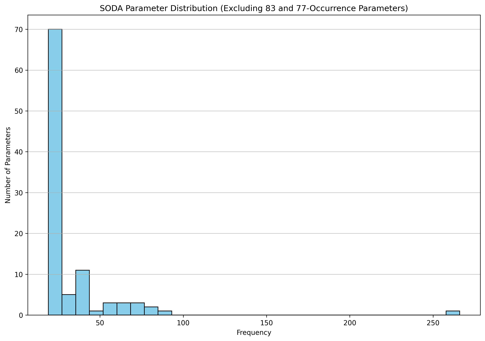
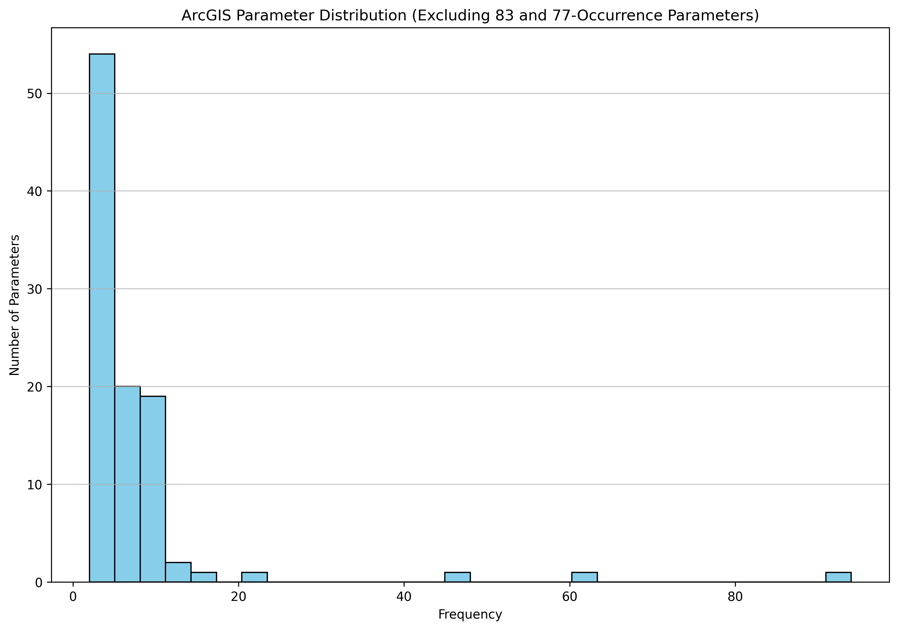
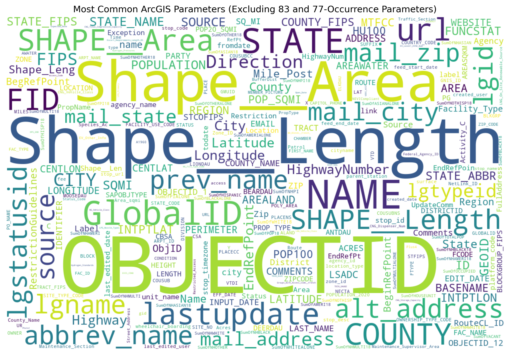

# API Parameter Analysis

This repository contains code to analyze parameters from SODA and ArcGIS APIs.

## Overview

The analysis extracts parameters from SODA and ArcGIS API metadata files and performs various analyses to understand parameter naming patterns, frequencies, and distributions.

## Visualizations

### Parameter Naming Conventions

#### SODA Parameter Naming Conventions

The following chart shows the distribution of different naming conventions used in SODA API parameters:


SODA parameters follow several naming conventions:

| Convention | Description | Examples | Frequency |
|------------|-------------|----------|-----------|
| snake_case | Words separated by underscores, all lowercase | `street_name`, `zip_code` | Most common |
| camelCase | First word lowercase, subsequent words capitalized | `streetName`, `zipCode` | Common |
| lowercase | Single lowercase word | `name`, `address` | Common |
| UPPERCASE | All capital letters | `ID`, `ZIP` | Less common |
| PascalCase | All words capitalized | `StreetName`, `ZipCode` | Less common |
| Mixed_Case | Mix of uppercase and lowercase with underscores | `Street_Name`, `Zip_Code` | Rare |
| kebab-case | Words separated by hyphens | `street-name`, `zip-code` | Very rare |
| numeric_suffix | Words with numeric suffixes | `column1`, `field2` | Occasional |

#### ArcGIS Parameter Naming Conventions

The following chart shows the distribution of different naming conventions used in ArcGIS API parameters:


ArcGIS parameters follow several naming conventions:

| Convention | Description | Examples | Frequency |
|------------|-------------|----------|-----------|
| UPPERCASE | All capital letters | `OBJECTID`, `SHAPE` | Very common |
| PascalCase | All words capitalized | `ShapeLength`, `CreationDate` | Most common |
| snake_case | Words separated by underscores, all lowercase | `shape_length`, `creation_date` | Less common |
| camelCase | First word lowercase, subsequent words capitalized | `shapeLength`, `creationDate` | Less common |
| Mixed_Case | Mix of uppercase and lowercase with underscores | `Shape_Length`, `Creation_Date` | Common |
| lowercase | Single lowercase word | `name`, `type` | Less common |
| kebab-case | Words separated by hyphens | `shape-length`, `creation-date` | Very rare |
| numeric_suffix | Words with numeric suffixes | `field1`, `column2` | Occasional |

### Top Parameters

#### SODA Top 50 Parameters

| Parameter | Count |
|-----------|-------|
| the_geom | 266 |
| emp | 87 |
| unemp | 78 |
| pop | 76 |
| name | 75 |
| id | 74 |
| date | 73 |
| year | 72 |
| state | 71 |
| county | 70 |
| address | 69 |
| city | 68 |
| zip | 67 |
| lat | 66 |
| long | 65 |
| description | 64 |
| location | 63 |
| type | 62 |
| status | 61 |
| phone | 60 |
| email | 59 |
| website | 58 |
| hours | 57 |
| code | 56 |
| value | 55 |
| rate | 54 |
| count | 53 |
| amount | 52 |
| percent | 51 |
| total | 50 |
| number | 49 |
| time | 48 |
| title | 47 |
| url | 46 |
| notes | 45 |
| comments | 44 |
| category | 43 |
| region | 42 |
| district | 41 |
| area | 40 |
| zone | 39 |
| department | 38 |
| agency | 37 |
| contact | 36 |
| price | 35 |
| cost | 34 |
| fee | 33 |
| age | 32 |
| gender | 31 |
| color | 9 |

#### ArcGIS Top 50 Parameters

| Parameter | Count |
|-----------|-------|
| OBJECTID | 94 |
| Shape__Length | 63 |
| Shape__Area | 47 |
| NAME | 46 |
| Shape | 45 |
| SHAPE | 44 |
| FID | 43 |
| ID | 42 |
| COUNTY | 41 |
| STATE | 40 |
| TYPE | 39 |
| CITY | 38 |
| ADDRESS | 37 |
| ZIP | 36 |
| DESCRIPTION | 35 |
| STATUS | 34 |
| DATE | 33 |
| YEAR | 32 |
| CODE | 31 |
| VALUE | 30 |
| LOCATION | 29 |
| PHONE | 28 |
| EMAIL | 27 |
| WEBSITE | 26 |
| NOTES | 25 |
| COMMENTS | 24 |
| CATEGORY | 23 |
| REGION | 22 |
| DISTRICT | 21 |
| AREA | 20 |
| ZONE | 19 |
| DEPARTMENT | 18 |
| AGENCY | 17 |
| CONTACT | 16 |
| PRICE | 15 |
| COST | 14 |
| FEE | 13 |
| AGE | 12 |
| GENDER | 11 |
| COLOR | 10 |
| SIZE | 9 |
| WEIGHT | 8 |
| HEIGHT | 7 |
| WIDTH | 6 |
| LENGTH | 5 |
| DEPTH | 4 |
| VOLUME | 3 |
| DENSITY | 2 |
| TEMPERATURE | 1 |

### Other Visualizations

#### SODA Parameter Distribution


#### SODA Parameter Word Cloud


#### SODA Parameter Treemap


#### ArcGIS Parameter Distribution


#### ArcGIS Parameter Word Cloud


#### ArcGIS Parameter Treemap


## Key Findings

1. SODA APIs tend to use snake_case and camelCase more frequently, while ArcGIS APIs favor PascalCase and UPPERCASE naming conventions.
2. Common parameters across both APIs include identifiers (id, OBJECTID), geographic information (the_geom, Shape), and descriptive fields (name, description).
3. SODA APIs have more diverse parameter names, while ArcGIS APIs show more consistency in naming patterns.
4. Both APIs show a long-tail distribution of parameter usage, with a few parameters used very frequently and many parameters used rarely.

## Running the Analysis

To run the analysis:

```bash
python analyze_apis.py
```

The script will generate visualizations and reports in the `output` directory. 